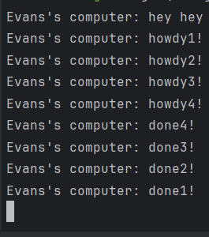

## 1.2. Understanding how it works.
 
Dari gambar ini terlihat bahwa program melakukan print "hey hey" terlebih dahulu kemudian baru melakukan print kode yang terdapat di dalam fungsi asynchronous. Hal ini terjadi karena spawner perlu menunggu executor agar di run terlebih dahulu. Setelah itu, "howdy" pun diprint dan setelah dua detik "done!" diprint oleh program.

## 1.3. Multiple Spawn and removing drop.
 
Spawning berfungsi untuk menjalankan program secara asynchronous dan concurrent dimana program pada spawner yang berbeda tidak dijalankan berurutan sesuai dengan baris kode, tetapi dijalankan secara bersamaan. Spawner berfungsi untuk membuat suatu fungsi asinkronus yang akan dimasukkan ke dalam task queue, executor berfungsi untuk mengeksekusi fungsi asinkronus yang terdapat pada task queue, dan drop berfungsi untuk menandai bahwa seluruh fungsi asinkronus pada task queue telah selesai dijalankan. Apabila drop dihapus dari program, program tidak akan berhenti karena program dianggap belum selesai. 