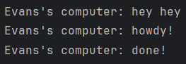

## 1.2. Understanding how it works.

Dari gambar ini terlihat bahwa program melakukan print "hey hey" terlebih dahulu kemudian baru melakukan print kode yang terdapat di dalam fungsi asynchronous. Hal ini terjadi karena spawner perlu menunggu executor agar di run terlebih dahulu. Setelah itu, "howdy" pun diprint dan setelah dua detik "done!" diprint oleh program.
